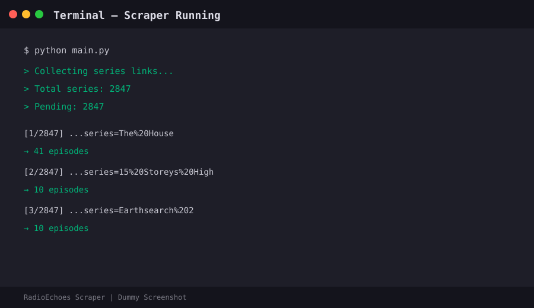
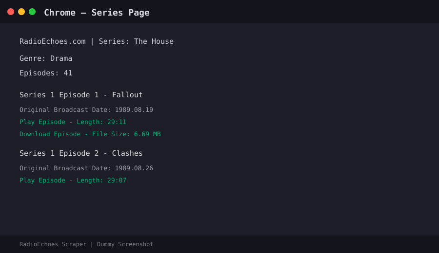
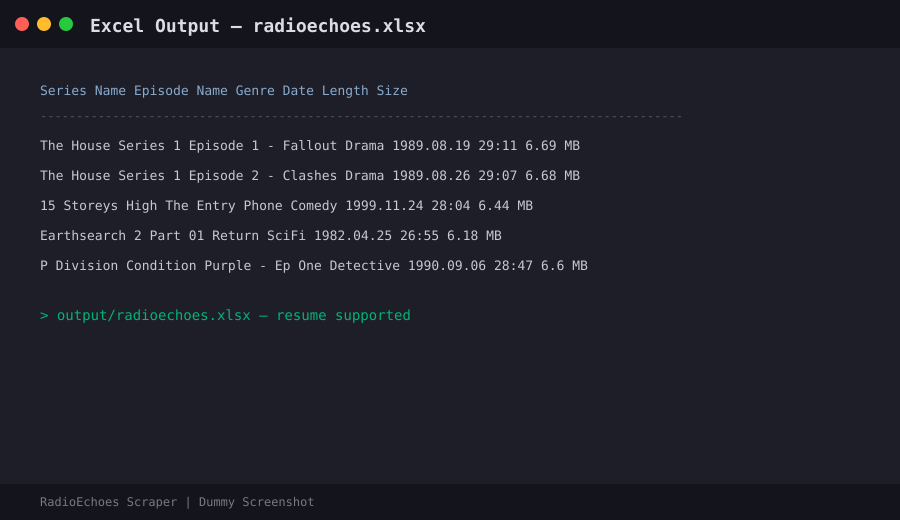

# RadioEchoes Scraper

Fast Playwright scraper for [RadioEchoes.com](https://www.radioechoes.com).

Scrapes all series + episodes (name, genre, broadcast date, length, play/download links, file size) into Excel with resume support.

## Screenshots

### Scraper Running


### Chrome — Series Page


### Excel Output


## Sample Output

See [`sample_output/sample_radioechoes.csv`](sample_output/sample_radioechoes.csv) for example data.

After a full run, real data is saved to `output/radioechoes.xlsx`.

## Features

- Concurrent scraping (4 pages at once)
- Resume support (skips already completed series)
- Excel output (`output/radioechoes.xlsx`)
- Logging (`logs/scraper.log`)
- Visible or headless Chrome

## Install

```bash
pip install -r requirements.txt
playwright install chromium
```

## Run

```bash
python main.py
```

## Config (`main.py`)

| Setting | Default | Description |
|---------|---------|-------------|
| `HEADLESS` | `False` | `True` = no browser window (faster) |
| `CONCURRENCY` | `4` | Parallel series (3–6 recommended) |
| `TIMEOUT` | `45000` | Page timeout in ms |

## Output

- `output/radioechoes.xlsx` — all scraped data
- `state/resume.json` — completed / failed series
- `logs/scraper.log` — run log

## Author

[Ahmad Raza](https://github.com/ahmadraza-automation) — Python Automation Engineer
